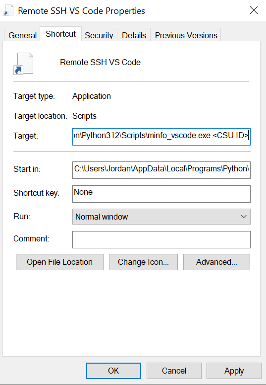

# ColoState Machine Info (Minfo)
A python module to fetch usage information on Colorado State's linux machines.
Tested using python 3.12.

## Installation
Minfo can be installed using pip:
```
pip install git+https://github.com/jschott515/colostate-minfo.git
```

# Minfo Tools
The following tools are added as executables in python's 'Scripts' directory when the colostate-minfo package is pip installed. Depending on your settings, this may or may not be on the PATH. These tools can be run from the Windows Command Prompt or similar.

## `minfo_ssh`
Launches an SSH session using the machine with the lowest CPU utilization.
Assumes that `ssh` is on the PATH. Alternatively, the path can be passed via command line.
Includes optional filter for the machine location, i.e. --location/-l lab325 to select from available "fish" machines.

### Usage
- `minfo_ssh <CSU NetID>`
- `minfo_ssh <CSU NetID> --location <Desired Location>`

For help:
- `minfo_ssh --help`


### Vscode Integration
A terminal profile can be created for vscode as follows:
```json
    "terminal.integrated.profiles.windows": {
        "ColoState": {
            "path": "minfo_ssh",
            "args": ["<CSU NetID>"],
        },
    },
```

## `minfo_vscode`
Launches a Vscode Remote SSH session using the machine with the lowest CPU utilization. Opens the remote machine's home directory by default.
Assumes that the Remote SSH extension is installed in vscode.
Assumes that `code.cmd` is on the PATH. Alternatively, the path can be passed via command line.
Includes optional filter for the machine location, i.e. --location/-l lab325 to select from available "fish" machines.

### Usage
- `minfo_vscode <CSU NetID>`
- `minfo_vscode <CSU NetID> --location <Desired Location>`

For help:
- `minfo_vscode --help`

### Desktop Shortcut
A desktop shortcut can be made by creating a shortcut to minfo_vscode.exe and adding the command line arguments to the target as follows:


